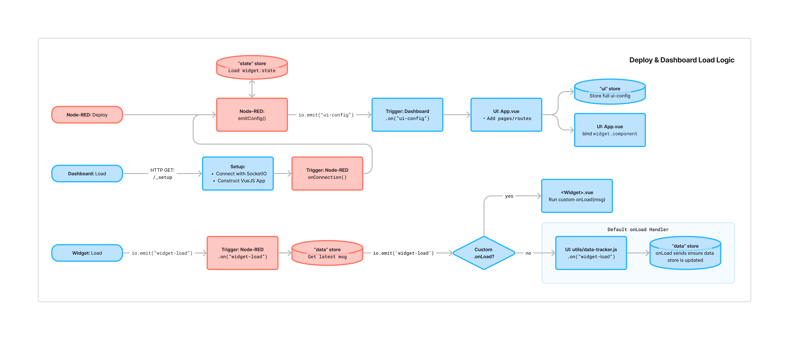
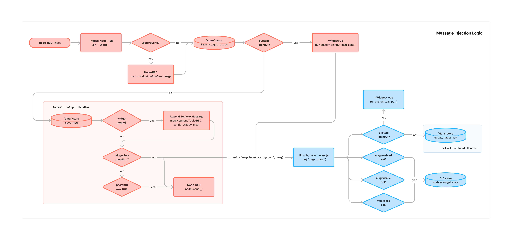
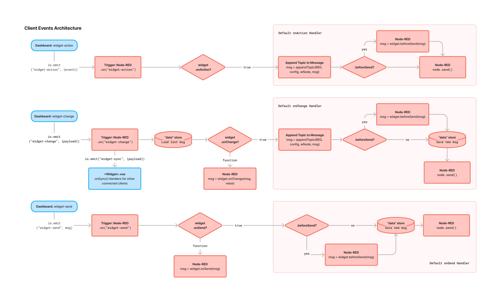

# Events Architecture

An important part of the Dashboard is how Node-RED and the Dashboard communicate. This is achieved using [socket.io](https://socket.io/).

Here, you can find details on the primary communications that occur between Node-RED (blocks in red) and the Dashboard (blocks in blue). The blocks make reference to particular functions and files within the source code to help navigate and understand where to find the relevant code.

Each of the cylindrical blocks directly refer to one of our client- or server-side stores, which are detailed in the [State Management](./state-management.md) guide.

## Architecture

We have broken the events architecture/traffic into three key groups:

- **Loading**: The initial loading of the Dashboard, or when a new configuration is sent by Node-RED on a fresh "Deploy".
- **Input**: When a message (`msg`) is received by a Dashboard node within Node-RED.
- **Dashboard Actions**: When a user interacts with a widget, or a widget sends a message back to Node-RED.

### "Loading" Event Flow

{data-zoomable}
*A flow diagram depicting how events traverse between Node-RED (red) and the Dashboard (blue) at deploy and first-load*

Here we detail the initial "Setup" HTTP request, consequent SocketIO traffic and appropriate handlers that are run when a Dashboard is deployed (via the Node-RED "Deploy" option), as well as when a Dashboard-client is first loaded.

Note the differentiation between a "Dashboard" loading, i.e. the full app and browser connection, and an individual "Widget" loading. The latter is fired for _each_ widget when it is mounted/rendered into the DOM.

### "Input" Event Flow

{data-zoomable}
*A flow diagram depicting how events traverse between Node-RED (red) and the Dashboard (blue) when messages are received by a Dashboard node*

This flow details the functions, and SocketIO traffic that occurs when a message is received by a Dashboard node within Node-RED. Note that most core FlowFuse Dashboard widgets use the default `onInput` handler, but in some cases, a custom `onInput` handler is used where we want different behaviour.

Our default server-side `onInput` handler handles the common use cases of:

- Updating the widget's value into our server-side data store
- Checking if the widget is configured to define a `msg.topic` and if so, updating the widget's `msg.topic` property
- Check if the widget is configured with a `passthrough` option, and if so, check it's value before emitting the `msg` object to any connected nodes.
- Emit the `msg` object to any connected nodes, if appropriate.

### "Dashboard Actions" Event Flow

Different widgets trigger different events depending on the specific use-cases. The following diagram shows the three types of events that the client can emit to the server, and how these are handled separately.

{data-zoomable}
*A flow diagram depicting how events traverse from Dashboard (blue) to Node-RED (red) when a user interacts with Dashboard*

Some examples of events that are emitted from the Dashboard to Node-RED include:

- `widget-change` - When a user changes the value of a widget, e.g. a slider or text input
- `widget-action` - When a user interacts with a widget, and state of the widget is not important, e.g. a button click
- `widget-send` - Used by `ui-template` to send a custom `msg` object, e.g. `send(msg)`, which will be stored in the server-side data store.

#### Syncing Widgets

The `widget-change` event is used to emit input from the server, and represents a change of state for that widget, e.g. a switch can be on/off by a user clicking it. In this case, if you have multiple clients connected to the same Node-RED instance, Dashboard will ensure that clients are in-sync when values change. 

For Example if you move a slider on one instance of the Dashboard, all sliders connected will also auto-update.

To disable this "single source of truth" design pattern, you can check the widget type in the ["Client Data"](../../user/multi-tenancy#configuring-client-data) tab of the Dashboard settings.

## Events List

This is a comprehensive list of all events that are sent between Node-RED and the Dashboard via socket.io.

### `ui-config`
- Payload: `object{ dashboards, theme, pages, groups, widgets }`

Used to transport dashboard/theme/page/groups/[widget](#widget) layout data, each mapped by their respective id's.

### `msg-input:<node-id>`
- Payload: `<msg>`

Sent from NR to UI when a msg input is received into a Dashboard node.

### `widget-load`
- ID: `<node-id>`
- Payload: `none`

Sent from UI to NR when the UI/widget is first loaded. Gives a chance for NR to provide the widget with any known existing values.

### `widget-change`
- ID: `<node-id>`
- Payload: `<value>` - typically the payload data to be sent in the msg

Sent from UI to NR when the value of a widget is changed from the UI, e.g. text input, slider. Assumes the value emitted is the `msg.payload`.

This takes hte previously received msg, and merges it with the newly received value, for example if the msg was:

```json
{
    "payload": 30,
    "topic": "on-change"
}
```

and the `widget-change` received a new value of `40`, then the newly emitted message would be:

```json
{
    "payload": 40,
    "topic": "on-change"
}
```

Any value received here will also be stored against the widget in the datastore.

### `widget-sync`
- Payload: `<msg>`

Triggered from the server-side `onChange` handler. This send a message out to all connected clients and informs relevant widgets of state/value changes. For example, when a slider is moved, the `widget-sync` message will ensure all connected clients, and their respective slider, are updated with the new value.

### `widget-action`
- ID: `<node-id>`
- Payload: `<msg>`

Sent from UI to NR when a widget is actioned, e.g. click of a button or upload of a file.

### `widget-send`
- ID: `<node-id>`
- Payload: `<msg>`

Generally used by `ui-template`. This event is wrapped by the Template's `send(msg)` function which allows users to define their own full `msg` objects to be emitted by a `ui-template` node. If a non-Object value is sent, then Dashboard will automatically wrap that into a `msg.payload` object, e.g:

```js
send(10)
```

will result in a `msg` object of:

```json
{
    "payload": 10 
}
```

Similarly, is instead an object is specified:

```js
send({ myVar: 10, topic: "my-topic" })
```

then the `msg` object will be:

```json
{
    "myVar": 10,
    "topic": "my-topic"
}
```

Any `msg` emitted using this function is also stored in the datastore associated with the widget.

## Event Payloads

This details some of the object structures used to send data cross the socket io connections between Node-RED and Dashboard.

### `Widget`

Within the `ui-config`, the `widgets` property is an array of `Widget` objects. Each `Widget` object has the following properties:

- **id**: The id assigned by Node-RED to uniquely identify that node in the editor
- **props**: The collection of properties that the user can define within the Editor for that node
- **component** - The respective Vue component required for rendering, added front-end (in App.vue)
- **state** - Contains value defining the visual and interactive "state" of a widget, e.g. `enabled: true` or `visible: false` (`visible: ` not yet supported)
