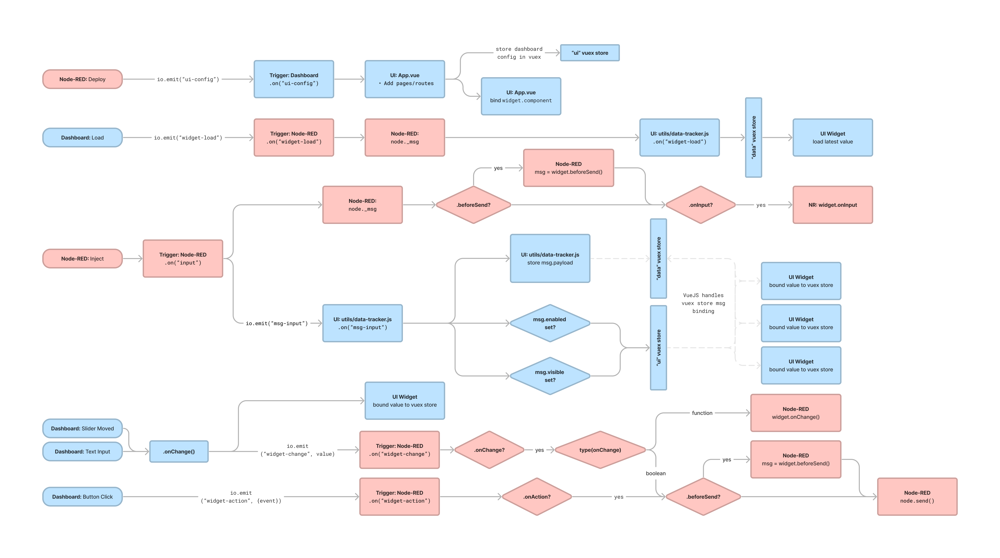

# Event Architecture

An important part of the Dashboard is how Node-RED and the Dashboard communicate. This is achieved using [socket.io](https://socket.io/).

{data-zoomable}
*A flow diagram depicting how events flow between Node-RED (red) and the Dashboard (blue)*

## Events List

This is a comprehensive list of all events that are sent between Node-RED and the Dashboard via socket.io.

### `ui-config`
- Payload: `object{ dashboards, theme, pages, groups, widgets }`

Used to transport dashboard/theme/page/groups/[widget](#widget) layout data, each mapped by their respective id's.

### `msg-input:<node-id>`
- Payload: `<msg>`

Sent from NR to UI when a msg input is received into a Dashboard node.

### `widget-load:<node-id>`
- Payload: `none`

Sent from UI to NR when the UI/widget is first loaded. Gives a chance for NR to provide the widget with any known existing values.

### `widget-change:<node-id>`
- Payload: `<value>`

Sent from UI to NR when the value of a widget is changed from the UI, e.g. text input, slider

### `widget-action:<node-id>`
- Payload: `<value>`

Sent from UI to NR when a widget is actioned, e.g. click of a button or upload of a file

## Event Payloads

This details some of the object structures used to send data cross the socket io connections between Node-RED and Dashboard.

### `Widget`

Within the `ui-config`, the `widgets` property is an array of `Widget` objects. Each `Widget` object has the following properties:

- **id**: The id assigned by Node-RED to uniquely identify that node in the editor
- **props**: The collection of properties that the user can define within the Editor for that node
- **component** - The respective Vue component required for rendering, added front-end (in App.vue)
- **state** - Contains value defining the visual and interactive "state" of a widget, e.g. `enabled: true` or `visible: false` (`visible: ` not yet supported)
