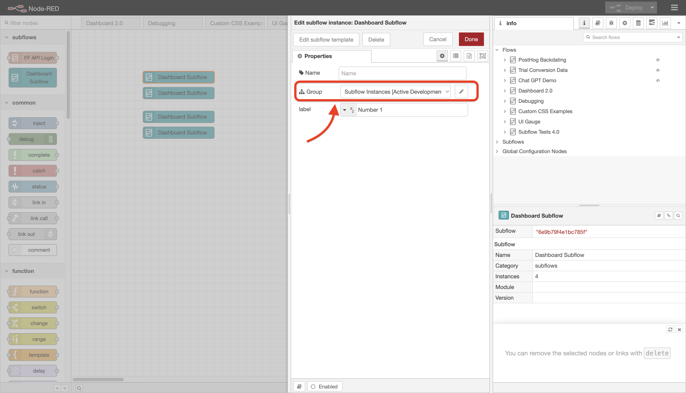
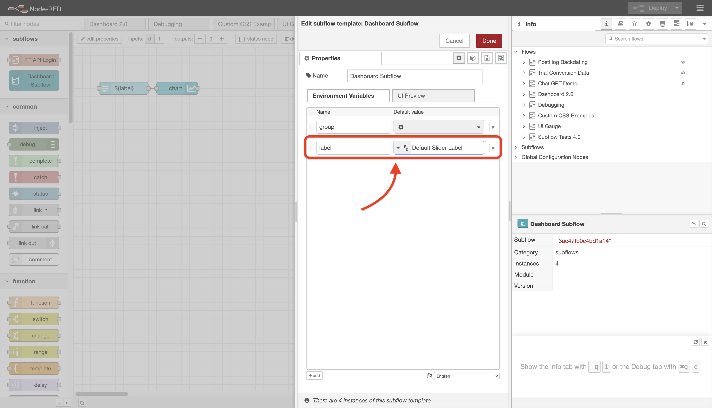
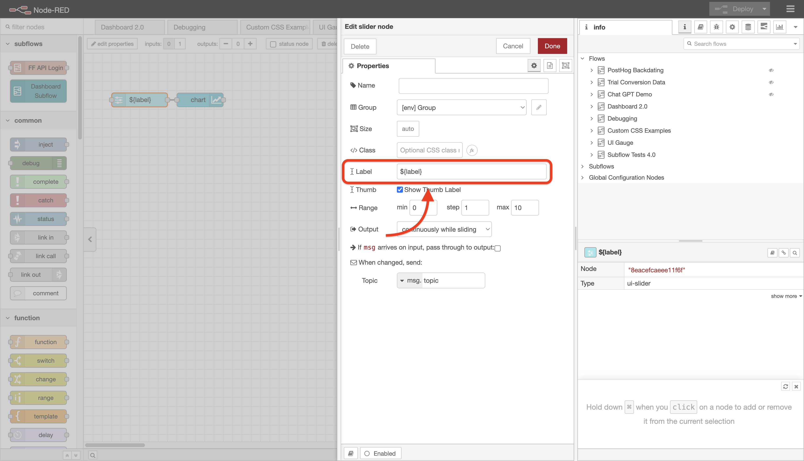

# Subflows

## What are subflows?

A subflow as an opportunity to build your own, completely custom node, with it's logic completely defined by other Node-RED nodes that you can configure and connect together in the workspace in any way you like.

Subflows remove the need to write any code, publish to npm, or maintain a separate repository. They are particularly useful for two reasons:

1. **Reusability:** You can use the same subflow in multiple places in your workspace, without having to copy and paste the same nodes over and over again. All subflows will read from the same configuration, and any changes to the subflow will be reflected in all instances of the subflow.
2. **Readability:** You can collapse a complex set of nodes into a single node, making your workspace easier to read and understand.

Subflows are not particular to Node-RED Dashboard 2.0, but are a core feature of Node-RED, and can be used on any set of nodes in your workspace.

## Subflows in Dashboard 2.0 <NodeREDVersion version="4.0.0" />

### Simple Example

Here, we demonstrate a quick example of creating a Dashboard 2.0 subflow. The subflow will consist of two nodes:

- `ui-slider` - A Dashboard 2.0 slider input node
- `ui-chart` - A Dashboard 2.0 chart output node to visualise the slider input value.

The output of the `ui-slider` will directly drive the values rendered on the chart.

The subflow itself will then permit two properties:

- `group` - The `ui-group` to render the slider and chart in.
- `label` - Text-based label which we will bind to the `ui-sliders`'s label.

<figure>
    <video controls>
        <source src="https://website-data.s3.eu-west-1.amazonaws.com/dashboard-subflows.mp4" type="video/mp4">
        Your browser does not support the video tag.
    </video>
    <em>A quick walkthrough showing an end-to-end creation and deployment of a Dashboard subflow.</em>
</figure>

Note how, with the subflow, we can copy and paste it as many times as we like, assign the subflows to different groups, and they will always render independently from each other.

### Configuring Subflows for Dashboard 2.0

#### Config Nodes

Dashboard 2.0 utilises Node-RED [config nodes](https://nodered.org/docs/creating-nodes/config-nodes) to manage the overall configuration/layout of the dashboard.

It's worth stressing that support for config nodes within a subflow (and consequently support for Dashboard 2.0 in subflows) is only available in Node-RED `v4.0.0` and above.

In total, Dashboard 2.0 has 4 types of config nodes:

- `ui-base` - Stores configuration for the full dashboard
- `ui-page` - Stores configuration for a single page, there can be multiple pages within a single `ui-base`.
- `ui-group` - Stores configuration for a single group, there can be multiple groups within a single `ui-page`.
- `ui-theme` - Stores configuration for the theme of the dashboard. These themes are assigned on a page-by-page basis.

Any of the first three here can be utilise within a subflow. It is not possible to use `ui-theme` as that's only a configuration option on _another_ config node, `ui-page`.

{data-zoomable}
*Screenshot of Node-RED, showing how to assign a ui-group type to a subflow property*

Then, for each instance of our subflow, we can now define a `ui-group` to render the subflow's nodes in:

{data-zoomable}
*Screenshot of Node-RED, showing the group option on a subflow instance*

#### Surfacing Node Properties

If you have a Dashboard 2.0 node within a subflow, you can configure your nodes such that their properties can instead be defined at the subflow-level, and so be unique for each instance of that subflow, e.g. a `ui-slider`'s label could be unique every time you use the subflow. 

Under the covers, subflows work by setting scoped Node-RED environment variables. These can then be utilised by the nodes within the subflow.

Let's say we want to set the `label` of a `ui-slider` within a subflow through a property on the subflow itself. First we have a new property (Environment Variable) on the subflow:

{data-zoomable}
*Screenshot of Node-RED, showing a "label" option defined on a subflow*

Note here that our environment variable here is `label`.

To then access this in the child nodes, in our case the `ui-slider`, we can set the slider's label property to `${label}`. Node-RED will then automatically replace this with the value of the `label` property on each of the subflow instances. 

{data-zoomable}
*Screenshot of Node-RED, showing how to use the environment variable to dynamically set a property on a subflow's child node*

##### Sizing

When setting the size of a widget node like ui-text or ui-button within a subflow you will be presented with text input fields for width and height instead
of the usual sizer widget. This is to permit setting the values externally via the subflow instance properties using the `${variable_name}` syntax.

NOTE: You can still set the widget width and height to `0` to make the it perform auto sizing.

## Customising Appearance

{data-zoomable}
*Screenshot of Node-RED, highlighting where the "Appearance" button is*

When editing a subflow's properties, you can click the "Appearance" tab in order to customise it's appearance when the subflow is rendered in the workspace flows.

You can control:

- **Category**: Which category to list this subflow in within the Node-RED palette (left-side of the Editor). This defaults to _"subflows"_.
- **Color**: The colour you want to render your subflow node.
- **Icon**: Which icon will show on your subflow node when used in hte workspace.
- **Port Labels**: If you have input or output for your subflow, here you can define appropriate labels for them.

{data-zoomable}
*Screenshot of a customised subflow copy+pasted multiple times in a Node-RED workspace*
