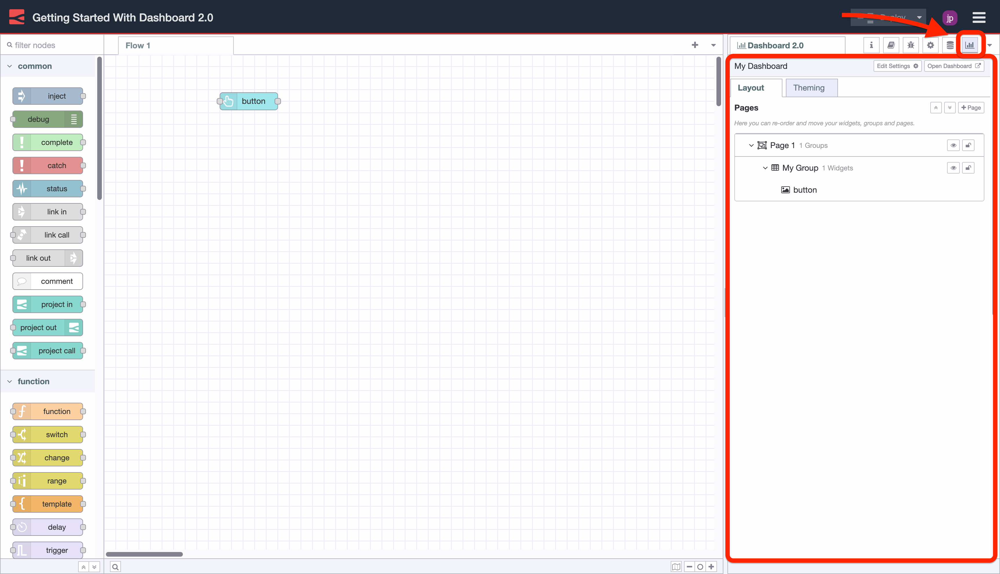
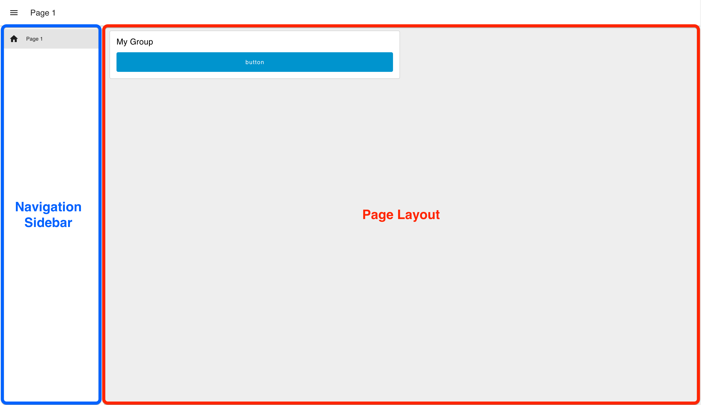
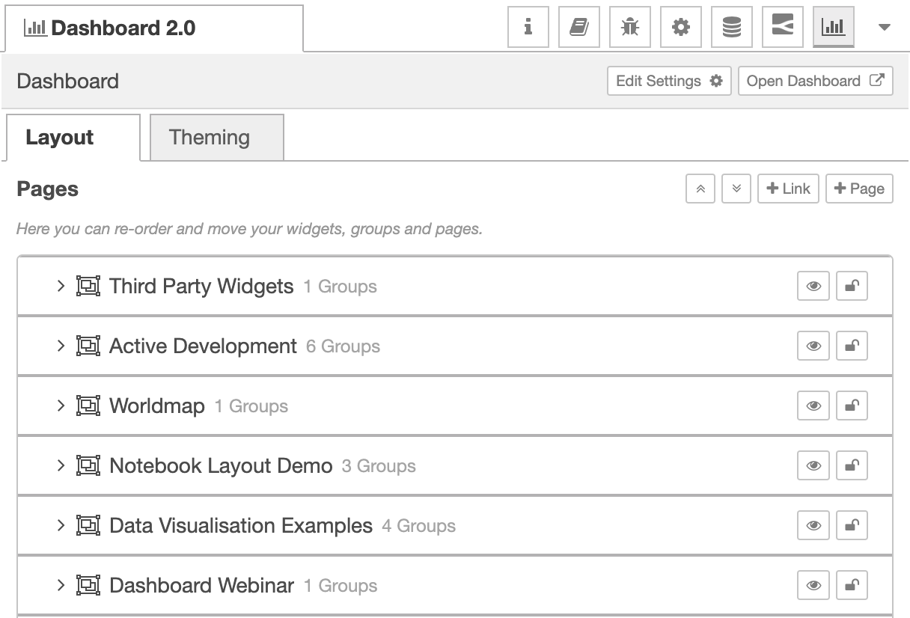

# Getting Started

## About

Welcome to the documentation for the FlowFuse Dashboard (also known as Node-RED Dashboard 2.0), the modern successor to the deprecated, but very popular, [Node-RED Dashboard](https://flows.nodered.org/node/node-red-dashboard).

This project was formed by [FlowFuse](https://flowfuse.com/), as part of efforts to upgrade the original Dashboard to steer away from Angular v1.0 which has been [officially deprecated](https://flowfuse.com/blog/2024/06/dashboard-1-deprecated/). You can read our full statement about _why_ we're building FlowFuse Dashboard [here](https://flowfuse.com/blog/2023/06/dashboard-announcement/?_gl=1*cckr5u*_gcl_au*MTAzMTA0MzY1Ni4xNzE2MzY2NTAz).

## Recommended Tutorials

<RecommendedTutorials />

## Installation

[FlowFuse](https://flowfuse.com) Dashboard is available in the Node-RED Palette Manager. To install it:

- Open the menu in the top-right of Node-RED
- Click "Manage Palette"
- Switch to the "Install" tab
- Search `node-red-dashboard`
- Install the `@flowfuse/node-red-dashboard` package (not `node-red/node-red-dashboard`)

{data-zoomable}
*Screenshot showing the nodes available in the Node-RED Palette Manager*

The nodes will then be available in your editor for you to get started.

If you want to use `npm` to install your nodes, you can instead [follow these instructions](https://nodered.org/docs/user-guide/runtime/adding-nodes)

## Dashboard Hierarchy

Each Dashboard is a collection of widgets (e.g. charts, buttons, forms) that can be configured and arranged in our own User Interface. The hierarchy of a Dashboard is as follows:

- **Base** - Defines the base URL (e.g. `/dashboard`) for your Dashboard.
- **Page** - A given page that a visitor can navigate to, URL will extend the base, e.g. `/dashboard/page1`. Each page can also have a defined, unique, Theme which controls the styling of all groups/widgets on the page.
- **Group** - A collection of widgets. Rendered onto a page.
- **Widget** - A single widget (e.g. chart, button, form) created in Dashboard.

## Adding your first widgets

With the nodes installed, getting started is as easy as choosing a node from the Palette (the left-hand side list of nodes) in Node-RED, and dropping it onto your canvas.

{data-zoomable}
_Screen recording to show how easy it is to deploy your first FlowFuse Dashboard application._

In this case, we drop in a `ui-button`, click "Deploy" and then can see the button running live in our user interface.

Notice too that Dashboard will automatically create a new group, page, theme and base Dashboard for you.

## Configuring your layout

FlowFuse Dashboard adds a corresponding "Dashboard 2.0" sidebar to the Node-RED editor . This sidebar provides an interface by which to view of your pages, themes, groups and widgets. From here you can add new pages and groups, modify existing settings, and re-order content to your liking.

{data-zoomable}
_Screenshot showing the Dashboard 2.0 sidebar in the Node-RED Editor._

Layout options in a Dashboard 2.0 user interface are controlled by two main settings:

- **Page Layout:** Controls how the `ui-groups`'s are presented on a given page in your application.
- **Navigation Sidebar:** Defines the left-side navigation style, defined at the `ui-base` level.

{data-zoomable}
_Example of the "Grid" page layout, with a "Collapsing" sidebar navigation._

### Default Page

Each page in FlowFuse Dashboard has a unique URL. If a user navigates to an unrecognised path, underneath the `/dashboard/` path, then a default page is used to fall back to. 

Currently, in FlowFuse Dashboard, the default page is chosen as the page ordered first in the list of pages in the side navigation:

{data-zoomable}
_Screenshot of the pages list in the FlowFuse Dashboard side panel_

In this example, the _"Third Party Widgets"_ page is the default page.

### Layout Options

Currently, we have three different options for a page's layout:

- **Grid:** ([docs](https://dashboard.flowfuse.com/layouts/types/grid.html)) The default layout for a page. It uses a 12-column grid structure to layout the groups. The widths of each group or widget defines the number of columns they will render in. So, a "width" of 6" would render to 50% of the screen. Grid layouts are entirely responsive, and will adjust to the size of the screen.
- **Fixed:** ([docs](https://dashboard.flowfuse.com/layouts/types/fixed.html)) Each component will render at a _fixed_ width, no matter what the screen size is. The "width" property is converted a fixed pixel value (multiples of 48px by default).
- **Notebook:** ([docs](https://dashboard.flowfuse.com/layouts/types/notebook.html)) This layout will stretch to 100% width, up to a maximum width of 1024px, and will centrally align. It's particularly useful for storytelling (e.g. articles/blogs) or analysis type user interfaces (e.g. Jupyter Notebooks), where you want the user to digest content in a particular order through scrolling.
- **Tabs:** ([docs](https://dashboard.flowfuse.com/layouts/types/tabs.html)) This layout organizes content into separate tabbed sections, allowing users to switch between different views or content categories without leaving the page. Each tab can contain multiple groups and widgets, and it’s specially useful for organizing large amounts of information into easily digestible segments. The "Tabs" layout ensures better navigation and a cleaner UI when multiple content categories need to be displayed in a single view.

### Navigation Sidebar

Built into the framework of the UI is a side navigation bar, along with the top, page-wide "app bar". Configuration options exist such that the side navigation behaviour can be controlled. Options include:

- **Collapsing:** When the sidebar is opened the page content will adjust with the width of the sidebar.
- **Fixed:** The full sidebar will always be visible, and the page content will adjust to the width of the sidebar.
- **Collapse to Icons:** When minimized, users can still navigate between pages by clicking on the icons representing each page in the sidebar.
- **Appear over Content:** When the sidebar is opened, the page is given an overlay, and the sidebar sits on top.
- **Always Hide:** The sidebar will never show, and navigation between pages can instead be driven by [`ui-control`](https://dashboard.flowfuse.com/nodes/widgets/ui-control.html).

## Design Patterns

There are two core Design Patterns that are possible when building with FlowFuse Dashboard:

- **Single Source of Truth:** All users of your Dashboard will see the same data. This is useful for industrial IoT or Home Automation applications.
- **Multi Tenancy:** Data shown in a particular widget is unique to a given client/session/user. This represents a more traditional web application, where each user has their own session and associated data.

It's worth noting that these two patterns can be mixed and matched within a single FlowFuse Dashboard application, shown [later](#example).

### Single Source of Truth

{data-zoomable}
_Example workflow to demonstrate the "Single Source of Truth" design pattern._

This is the pattern that the original Node-RED Dashboard utilized. In this pattern, all users of the Dashboard will see the same data. Data that populates a widget is generally driven by a piece of hardware or general-purpose API call.

When a user goes to visit a Dashboard, the widgets will load their respective state, and will display it to every user. 

An example of this is that if you have interactive elements, e.g. a slider linked to a chart, then one user moving the slider will draw data to the chart of every other user's Dashboards too.

### Multi Tenancy

{data-zoomable}
_Example workflow to demonstrate the "Multi Tenancy" design pattern._

In FlowFuse Dashboard we can configure a given node type to ["Accept Client Data"](/user/sidebar.html#client-data) from the sidebar:

<em>Screenshot of an example "Client Data" tab</em>

If "Include Client Data" is toggled on, then _all_ `msg` objects emitted from _all_ nodes will contain a `msg._client` object, which will at a minimum detail the `socketId` for the connected client. It is possible to add on more data to this object, such as a username, email address, or other unique identifier with Dashboard plugins, e.g. the [FlowFuse User Plugin](https://flowfuse.com/blog/2024/04/displaying-logged-in-users-on-dashboard/).

The "Accept Client Data" table allow configuration over which node types will pay attention to any provided `msg._client` information. Any `msg` sent _to_ one of these nodes can include a `msg._client` value to specify a particular connection (e.g. username, socket ID) that the data should be sent to, rather than to all clients.

For users familiar with the original Node-RED Dashboard, you'll recognise this pattern from what you could do with `ui-notification` and `ui-control`, now, in FlowFuse Dashboard, it's possible for _all_ widgets.

The key here is that data is generally injected into a node as a consequence of a user action, e.g. clicking a button, viewing a page, or submitting a form, and the responding data is sent _only_ back to that user.

An easy example of this design pattern in FlowFuse Dashboard is to utilise the [UI Event](./nodes/widgets/ui-event.md) node. The `ui-event` node emits a `msg` when a user loads a page. Within the `msg` is a full `msg._client` data object available for that client's connection. If this message is then sent onto another node that accept client data, then that full `msg` will _only_ be sent to that specified client.

### Example

Here we have a flow that will produce some client-defined data, and some shared data. When importing, be sure to check that in the Dashboard 2.0 sidebar, both `ui-text` and `ui-template` are checked in the "Accepts Client Data" table.

<video controls>
    <source src="./assets/videos/demo-design-patterns.mp4" type="video/mp4">
    Your browser does not support the video tag.
</video>

In the video above we see that in some cases, data is sent to just the client that triggered it (e.g. button clicks), and in others, the data is shared across all client sessions (e.g. the visualisation of slider value on the chart).

If you'd like to play with this example, the flow is as follows:

<FlowViewer :flow="examples['design-patterns']" height="425px" style="margin-bottom: 24px;"/>

To cover a little more detail about the flow itself:

#### Client-Driven Data

For this use-case we've set `ui-text` and `ui-template` configured in the sidebar to "Accept Client Constraints".

In the top-half, the `ui-event` node will emit a message when a user loads the page. This message will contain a `msg._client` object, which is unique to that user's connection. This message is then sent to a `ui-template` node, which will display the socket ID of the specific user.

Similarly, we also have a button, which will also emit `msg._client` data (as all nodes will do), but this time it will be sent to a `ui-text` node. The `ui-text` will show the timestamp of the last time that the given client/user clicked that button.

#### Shared Data (All Clients)

This section of the flow demonstrates how a slider can be used to control a chart, note that we wire the slider straight into the chart because the `ui-chart` has not been configured to "Accept Client Data".

We also connect the `ui-slider` to two `ui-template` nodes. Given that `ui-template` nodes _are_ configured to "Accept Client Data", we can demonstrate both shared and client-specific data in the same flow by deleting `msg._client` data on the way to the lower `ui-template` node. By removing this, any slider data sent here will be sent to _all_ connections, because the `msg` doesn't specify a `_client`. The top `ui-template` will only update for the client that moved the slider.

## Contributing

If you would like to run this set of nodes locally, and specifically to help contribute to the development efforts, you can read the [Contributing](./contributing/index.md) documentation.

If you'd like to build your own standalone nodes & widgets that integrate seamlessly with FlowFuse Dashboard, you can read our guide on that [here](./contributing/widgets/third-party.md).
