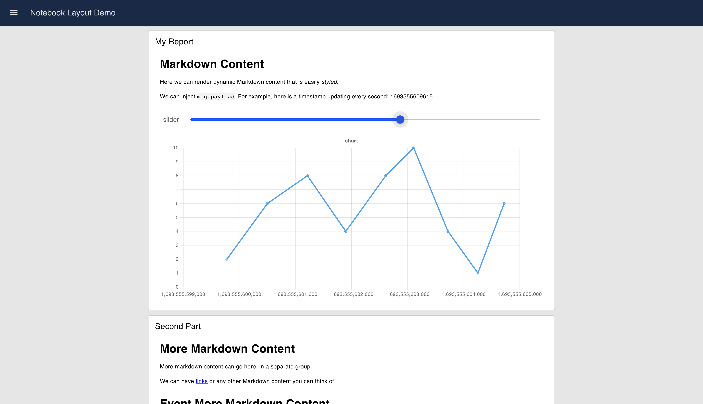
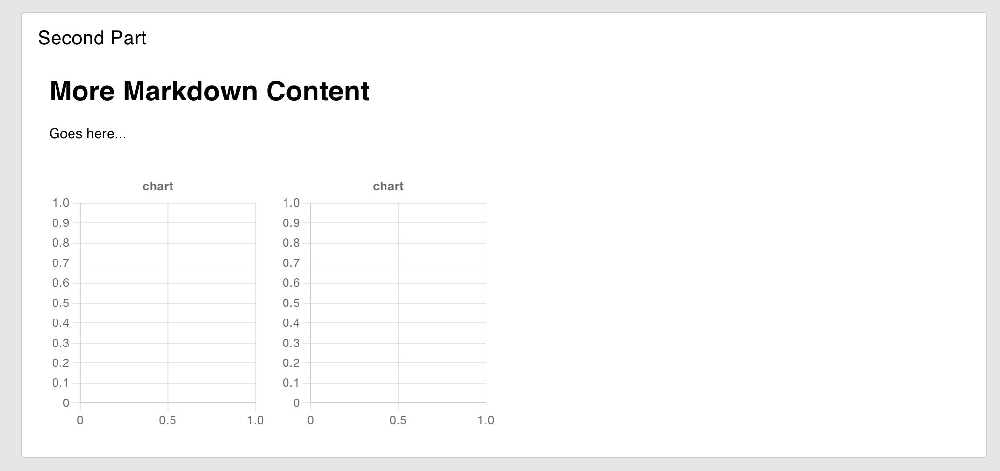

# Layout: Notebook <AddedIn version="0.4.0" />

This layout mimics a traditional Jupyter Notebook, where the layout will stretch to 100% width, up to a maximum width of 1024px, and will centrally align.

A common use case for this type of layout would be to inject dynamic Markdown, data tables and data visualisations.

{data-zoomable}
*An example UI rendered using the "Notebook" Layout*

## Controlling Width & Columns

In other layouts, each Group's width controls exactly that, the rendered width of the group on screen. However, in the Notebook layout, "width" actually better translates to "columns". Each group will always be rendered to `width: 100%` of the Notebook. By increasing the "width" of a group, you're actually increasing the number of columns that group will represent, within which the widgets will render.

This provides the means to add finer grain control over the layout of your UI, allowing you to put more widgets side-by-side in a single row.

A group has a default width of "6" columns, here we can see two charts, rendered side-by-side, with each chart having a "width" of 3 columns.

{data-zoomable}
*An example UI rendered using the "Notebook" Layout*

If we increase the "width" (number of columns) of the group to 12, then the two charts are then setup to only take up half of the width of the group (3 columns each).

{data-zoomable}
*An example UI rendered using the "Notebook" Layout*