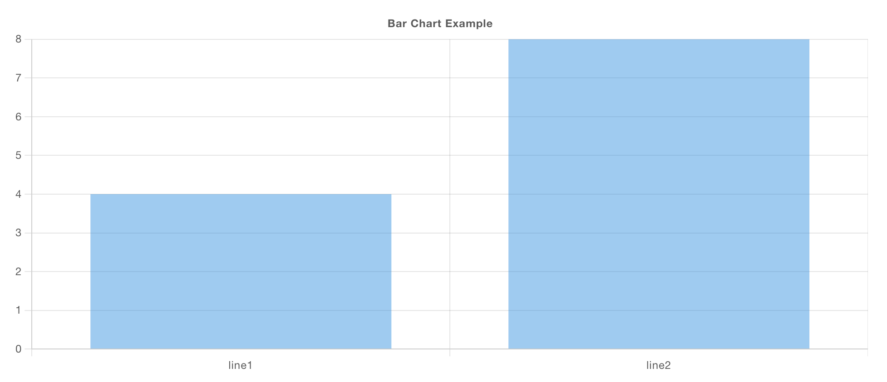

---
props:
    Group: Defines which group of the UI Dashboard this widget will render in.
    Size: Controls the width of the button with respect to the parent group. Maximum value is the width of the group.
    Label: The text shown within the button.
    Class: The text shown within the button.
    Chart Type: Line | Bar | Scatter
    X-Axis Type: Timescale | Linear | Categorical
    X-Axis Limit: Any data that is before the specific time limit (for time charts) or where there are more data points than the limit specified will be removed from the chart.
---

# Chart `ui-chart`

Provides configuration options to create the following chart types:

- [Line Chart](#line-chart)
- [Scatter Plot](#scatter-plot)
- [Bar Chart](#bar-graph)

## Properties

<PropsTable/>

## Controls

### Removing Data

In order to remove all data from a chart you can send a `msg.payload` of `[]` to the node.

Most commonly, this is done by wiring a `ui-button` to the `ui-chart` node and configuring the button to send a JSON payload with a value of `[]`.


## Chart Types

### Line Chart

{data-zoomable}
*Example of a rendered line chart with a "time" x-axis.*

#### Payloads

Line Charts accept a variety of payload formats. The following are all valid:

- `msg.payload = <value>`
    - In this case, the value received by the chart will be used as a `y` value, and the `x` value will be automatically added as the current date/time.
- `msg.payload = { y: <value> }`
    - In this case, the `y` value will be used as defined, and the `x` value will be calculated as the current date/time.
- `msg.payload = { x: <value>, y: <value> }`
    - In this case, the `x` and `y` values will be used as the `x` and `y` values of the data point.

#### Multiple Lines

If you would like to plot multiple lines on the same chart, you can do so by including a `msg.topic` alongside the relevant `msg.payload`, e.g:

```json
{
    "topic": "line-1",
    "payload": 1
}
```

```json
{
    "topic": "line-2",
    "payload": 2
}
```

### Scatter Plot

{data-zoomable}
*Example of a rendered scatter plot with a "time" x-axis.*

#### Payloads

Scatter Plots accept a variety of payload formats. The following are all valid:

- `msg.payload = <value>`
    - In this case, the value received by the chart will be used as a `y` value, and the `x` value will be automatically added as the current date/time.
- `msg.payload = { y: <value> }`
    - In this case, the `y` value will be used as defined, and the `x` value will be calculated as the current date/time.
- `msg.payload = { x: <value>, y: <value> }`
    - In this case, the `x` and `y` values will be used as the `x` and `y` values of the data point.

### Bar Graph

{data-zoomable}
*Example of a rendered bar graph.*